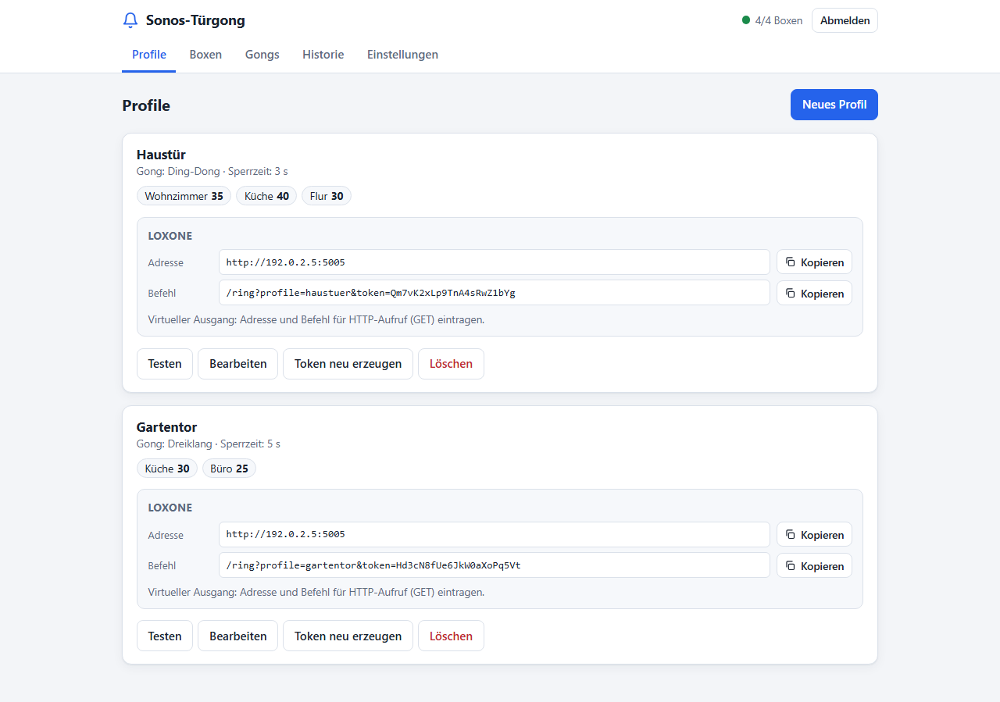

# Sonos-Türgong für Loxone

[](LICENSE)

Spielt beim Klingeln einen Türgong über Sonos-Boxen ab, ausgelöst vom Loxone
Miniserver. Der Gong läuft als **Sonos-Ansage**: Laufende Musik wird nicht
unterbrochen, sondern kurz leiser gestellt und läuft danach normal weiter.
Eingerichtet wird alles in einer Weboberfläche, Konfigurationsdateien sind
nicht nötig.



**➜ Ausführliche Anleitung mit Screenshots: [docs/anleitung.md](docs/anleitung.md)**

```
Klingeltaster ──► Loxone Miniserver ──HTTP──► sonos-doorbell ──Websocket──► Sonos-Boxen
                  (virtueller Ausgang)        (Docker)          (Port 1443)
```

## Funktionen

- Weboberfläche mit Passwortschutz für Boxen, Profile, Gongs, Historie und Backup
- **Profile** (z. B. „Haustür“, „Garage“): eigener Gong, eigene Sperrzeit,
  beliebige Boxen mit **Lautstärke pro Box** und ein eigener Token
- Boxen per Klick im Netzwerk finden oder per IP von Hand anlegen
- Vier mitgelieferte Gongs (Ding-Dong, Dreiklang, Einzelton, Westminster) und
  eigene Uploads in jedem gängigen Audioformat; sie werden automatisch in MP3
  umgewandelt, von Stille am Anfang befreit, in der Lautstärke angeglichen und
  auf 10 Sekunden begrenzt
- Testgong pro Profil und pro Box direkt in der Oberfläche
- Historie der letzten 30 Tage mit Ergebnis und Reaktionszeit je Box
- Fertiger Loxone-Befehl pro Profil zum Kopieren
- Backup und Wiederherstellung als ZIP
- Musik wird während des Gongs leiser gestellt und läuft danach weiter, bei
  jeder Quelle: Sonos-App, Spotify Connect, AirPlay, Radio, TV
- Kurze Reaktionszeit: Die Verbindungen zu den Boxen sind dauerhaft offen,
  beim Klingeln wird nur ein Befehl gesendet
- Läuft lokal, ohne Sonos-Konto, ohne Cloud und ohne LoxBerry

## Voraussetzungen

- Sonos-Boxen mit **S2**. Sie müssen die Ansagefunktion (`AUDIO_CLIP`)
  unterstützen; in der Box-Liste zeigt ein grüner Punkt, dass die Verbindung steht.
- Ein Docker-Host im selben Netz wie die Boxen (NAS, Raspberry Pi, Server)
- Loxone Miniserver mit Loxone Config

## Installation

### Mit Portainer (Git-Repository)

1. In Portainer: **Stacks → Add stack → Repository**.
2. Diese Felder ausfüllen:
   - **Name:** `sonos-doorbell`
   - **Repository URL:** URL dieses Repos. Bei einem privaten Repo
     „Authentication“ aktivieren und Benutzer und Token eintragen.
   - **Repository reference:** `refs/heads/main`
   - **Compose path:** `docker-compose.yml`
3. Environment variables sind **nicht nötig**. Optional lassen sich Startwerte
   setzen, siehe [Umgebungsvariablen](#umgebungsvariablen).
4. Optional **GitOps updates** aktivieren (Polling oder Webhook). Dann
   übernimmt Portainer Änderungen im Repo automatisch.
5. **Deploy the stack**. Portainer baut das Image auf dem Host (inklusive
   ffmpeg) und startet den Container.
6. Die Oberfläche öffnen: `http://<nas-ip>:5005`.

Alle Einstellungen liegen im Docker-Volume `sonos-doorbell-data` und bleiben
bei Updates und Neustarts erhalten.

### Mit Docker Compose

```bash
git clone <repo-url> sonos-doorbell
cd sonos-doorbell
docker compose up -d --build
```

Danach `http://<host>:5005` öffnen.

### Hinweis zum Netzwerk

Der Container läuft mit `network_mode: host`. Das ist nötig, damit die Boxen
per Multicast gefunden werden und den Gong vom Host abrufen können. Unter
Linux funktioniert das direkt.

Bei **Docker Desktop (Windows/macOS)** muss Host-Networking in den
Einstellungen aktiviert sein. Alternativ:
- in `docker-compose.yml` `network_mode: host` durch `ports: ["5005:5005"]` ersetzen,
- die Boxen per IP von Hand anlegen (die Suche per Multicast geht dann nicht),
- unter Einstellungen die LAN-IP des Rechners als „Adresse dieses Servers“ eintragen.

## Einrichtung in der Weboberfläche

1. **Passwort festlegen.** Beim ersten Aufruf erscheint die Einrichtung; das
   Passwort braucht mindestens 8 Zeichen. Danach folgt die Anmeldung.
2. **Boxen anlegen** (Reiter *Boxen*): „Im Netzwerk suchen“ listet die
   gefundenen Boxen, „Hinzufügen“ übernimmt sie. Alternativ eine Box per IP
   eintragen; ohne Namen wird der Name aus Sonos übernommen.
3. **Gongs** (Reiter *Gongs*): Die vier eingebauten Gongs sind sofort da. Eigene
   Dateien lassen sich mit einem Namen hochladen (max. 20 MB).
4. **Profil anlegen** (Reiter *Profile*): Namen, Gong und Sperrzeit wählen, die
   Boxen ankreuzen und je Box die Lautstärke einstellen. Mit „Testen“ wird der
   Gong sofort abgespielt, unabhängig von der Sperrzeit.
5. **Einstellungen:** Unter „Adresse dieses Servers (für die Boxen)“ steht die IP des Docker-Hosts,
   unter der die Boxen den Gong abrufen. Leer bedeutet automatische Erkennung.
   Bei Host-Networking passt das in der Regel; sonst die LAN-IP des Hosts eintragen.

### Eigene Gongs

Die Datei wird beim Hochladen mit ffmpeg umgewandelt: MP3, Stille am Anfang
entfernt, Lautstärke angeglichen, nach 10 Sekunden mit Ausblenden beendet.
Die eingebauten Gongs lassen sich nicht löschen. Ein Gong, den noch ein Profil
verwendet, kann nicht gelöscht werden.

Die eingebauten Gongs liegen als WAV-Dateien in [`sounds/`](sounds) und werden mit
[`tools/make_gong.py`](tools/make_gong.py) erzeugt.

## Einrichtung in Loxone Config

Jedes Profil zeigt in der Oberfläche einen fertigen **Loxone-Block** mit Adresse
und Befehl, jeweils mit Kopieren-Schaltfläche.

1. **Virtueller Ausgang** anlegen (Peripherie → Virtuelle Ausgänge):
   - Bezeichnung: `Sonos-Türgong`
   - Adresse: `http://<nas-ip>:5005` (steht im Profil)
2. Darunter einen **Virtuellen Ausgang Befehl** anlegen:
   - Bezeichnung: z. B. `Haustür`
   - Befehl bei EIN: `/ring?profile=<profil-id>&token=<token>` (aus dem Profil kopieren)
   - HTTP-Methode: `GET`
   - Befehl bei AUS: leer lassen
   - „Als Digitalausgang verwenden“: aktiv
3. Den Befehl mit dem Klingelsignal verbinden: Klingeltaster-Eingang oder der
   Ausgang „Klingel“ des Intercom-Bausteins. Bei Dauersignal einen
   Monoflop/Impuls davor setzen.
4. Für weitere Türen oder Tageszeiten weitere Profile anlegen und je einen
   eigenen Befehl einrichten.

### Token

Jedes Profil hat einen eigenen geheimen Token, der Aufrufe ohne Anmeldung
absichert. Mit „Token neu erzeugen“ wird er ersetzt; der alte Befehl in Loxone
funktioniert dann nicht mehr und muss angepasst werden. Aufrufe ohne gültiges
Profil und Token werden mit `403` abgewiesen.

## HTTP-Schnittstelle für Loxone

| Aufruf | Wirkung |
|---|---|
| `GET /ring?profile=<id>&token=<token>` | Gong des Profils |
| `GET /health` | Lebenszeichen, wird auch vom Docker-Healthcheck genutzt |
| `GET /sounds/<datei>` | Gong-Dateien; von hier laden die Boxen den Gong |

Antworten von `/ring`:

| Code | Bedeutung |
|---|---|
| `202` | Gong gestartet |
| `200` mit `"status": "ignored"` | Sperrzeit des Profils läuft noch |
| `403` | Profil oder Token fehlt oder ist ungültig |
| `422` | Profil hat keine Boxen oder der Gong fehlt |

Alles andere (`/api/...`) ist die Schnittstelle der Weboberfläche und erfordert
die Anmeldung.

## Backup und Wiederherstellung

Unter *Einstellungen* lädt „Backup herunterladen“ eine ZIP-Datei mit Boxen,
Profilen (**inklusive Tokens**), Einstellungen und hochgeladenen Gongs. Das
Passwort ist nicht enthalten. „Wiederherstellen“ ersetzt alle Einstellungen
durch den Inhalt der ZIP-Datei; das Passwort bleibt bestehen. Die Datei enthält
die Tokens und sollte entsprechend sicher aufbewahrt werden.

## Passwort vergessen

In Portainer die Konsole des Containers `sonos-doorbell` öffnen (Containers →
`sonos-doorbell` → Console → `/bin/sh`) und ausführen:

```bash
rm /data/auth.json
```

Danach den Container neu starten. Beim nächsten Aufruf der Oberfläche wird ein
neues Passwort festgelegt. Boxen, Profile und Gongs bleiben erhalten.

## Umgebungsvariablen

Die Einstellungen werden in der Weboberfläche vorgenommen. Die folgenden
Variablen sind alle optional. Die **Startwerte** gelten nur beim allerersten
Start, solange im Volume noch keine Konfiguration liegt. Sie legen Boxen und ein
Profil „Standard“ an; danach zählt allein die Oberfläche. Vorlage:
[`stack.env.example`](stack.env.example).

| Variable | Bedeutung | Standard |
|---|---|---|
| `PORT` | HTTP-Port des Dienstes | `5005` |
| `LOG_LEVEL` | `DEBUG`, `INFO`, `WARNING` | `INFO` |
| `TZ` | Zeitzone für Logs und Historie | `Europe/Berlin` |
| `DATA_DIR` | Ordner für die Konfiguration (im Image fest `/data`) | `/data` |
| `SOUNDS_DIR` | Ordner der eingebauten Gongs (im Image fest `/sounds`) | `/sounds` |
| `DISCOVERY_REFRESH_S` | Abstand, in dem die Verbindungen zu den Boxen geprüft werden | `300` |

Startwerte, nur beim ersten Start:

| Variable | Bedeutung | Standard |
|---|---|---|
| `ADVERTISE_HOST` | Adresse des Docker-Hosts für die Boxen | automatisch |
| `PLAYERS` | Boxen als `Name=IP`, kommagetrennt | – |
| `DEFAULT_ZONES` | Boxen des Profils „Standard“, kommagetrennt, oder `all` | `all` |
| `DEFAULT_SOUND` | `ding-dong`, `dreiklang`, `einzelton` oder `westminster` | `ding-dong` |
| `DEFAULT_VOLUME` | Lautstärke (0–100) | `30` |
| `ZONE_VOLUMES` | Abweichende Lautstärke pro Box, z. B. `Küche=40,Bad=20` | – |
| `COOLDOWN_S` | Sperrzeit des Profils in Sekunden | `3` |

## Wie es funktioniert

1. Der Dienst öffnet zu jeder angelegten Box eine dauerhafte Websocket-Verbindung
   auf Port 1443 und prüft sie regelmäßig.
2. Ruft Loxone `/ring` mit gültigem Profil und Token auf, antwortet der Dienst
   sofort mit `202`. Danach schickt er allen Boxen des Profils gleichzeitig den
   Befehl `loadAudioClip` mit der Adresse der Gong-Datei und der Lautstärke der Box.
3. Jede Box lädt die Datei per HTTP vom Dienst und spielt sie über die
   laufende Wiedergabe. Die Musik wird dabei von der Box selbst leiser
   gestellt und danach wiederhergestellt.

Genutzt wird die lokale Steuerschnittstelle der S2-Boxen, über die auch die
Sonos-App und Home Assistant Ansagen abspielen.

## Fehlersuche

| Problem | Ursache und Lösung |
|---|---|
| Box zeigt keinen grünen Punkt | Box nicht erreichbar oder Port 1443 blockiert (Firewall, getrenntes VLAN). Box muss S2 nutzen. |
| Testgong läuft ohne Fehler, aber kein Ton | Die Box kann die Gong-Datei nicht laden. Unter *Einstellungen* die „Adresse dieses Servers“ prüfen und von einem anderen Gerät im LAN `http://<nas-ip>:5005/sounds/ding-dong.wav` öffnen. Port 5005 in der Host-Firewall freigeben. |
| Historie zeigt `loadAudioClip abgelehnt` | Die Box lehnt die Ansage ab; der `errorCode` nennt den Grund. |
| „Im Netzwerk suchen“ findet nichts | Multicast funktioniert nicht (z. B. Docker Desktop, VLAN). Boxen per IP anlegen. |
| Upload schlägt fehl | Die Datei ist kein gültiges Audio, größer als 20 MB, oder ffmpeg fehlt (nur bei Betrieb ohne das Docker-Image). |
| Loxone-Aufruf liefert `403` | Profil-ID oder Token stimmen nicht, z. B. nach „Token neu erzeugen“. Befehl aus dem Profil neu kopieren. |

Ausführliche Meldungen gibt es mit `LOG_LEVEL=DEBUG`.

## Projektstruktur

```
app/
  main.py       HTTP-Endpunkte der Oberfläche und /ring, App-Fabrik
  chime.py      Klingel-Logik: Profile, Sperrzeit, parallel senden
  clip.py       Websocket-Client für die Sonos-Ansagen (audioClip)
  store.py      Boxen, Profile, Gongs: Datenmodell und Speichern
  auth.py       Passwort und Sitzungen
  sounds.py     Eingebaute und hochgeladene Gongs, ffmpeg-Verarbeitung
  history.py    Historie der Klingelvorgänge
  backup.py     Backup und Wiederherstellung
  discovery.py  Suche und Abfrage von Sonos-Boxen
  config.py     Prozess-Einstellungen und Startwerte aus Umgebungsvariablen
  static/       Weboberfläche (HTML, CSS, JavaScript)
sounds/         Eingebaute Gongs
tests/          Tests (pytest)
tools/          Skripte: eingebaute Gongs erzeugen, Screenshots erstellen
docs/           Anleitung und Screenshots
```

## Entwicklung

```bash
python -m venv .venv
.venv/Scripts/pip install -r requirements-dev.txt   # Linux/macOS: .venv/bin/pip
.venv/Scripts/python -m pytest
```

Die Screenshots der Anleitung entstehen aus Demodaten und lassen sich neu
erzeugen (benötigt Edge, Chrome oder Chromium; sonst `BROWSER_PATH` setzen):

```bash
.venv/Scripts/python tools/screenshots.py
```

Lokal ohne Docker starten (für Uploads wird ffmpeg benötigt):

```bash
DATA_DIR=./data SOUNDS_DIR=sounds .venv/bin/python -m uvicorn app.main:app --host 0.0.0.0 --port 5005
```

## Haftungsausschluss

Dieses Projekt ist kein offizielles Produkt und steht in keiner Verbindung zu
Sonos, Inc. oder der Loxone Electronics GmbH. Sonos und Loxone sind Marken
ihrer jeweiligen Inhaber. Die genutzte lokale Schnittstelle der Boxen kann sich
mit Firmware-Updates ändern.

## Lizenz

[MIT](LICENSE)
