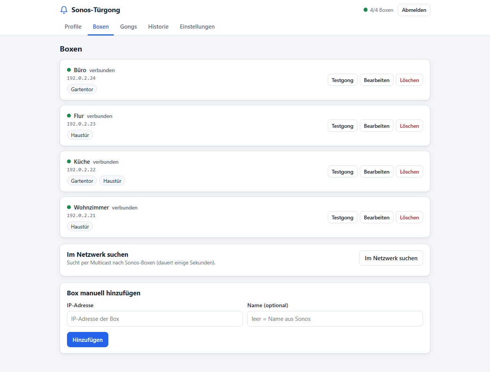
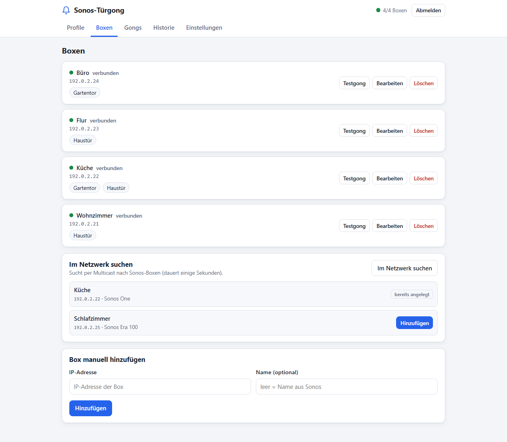
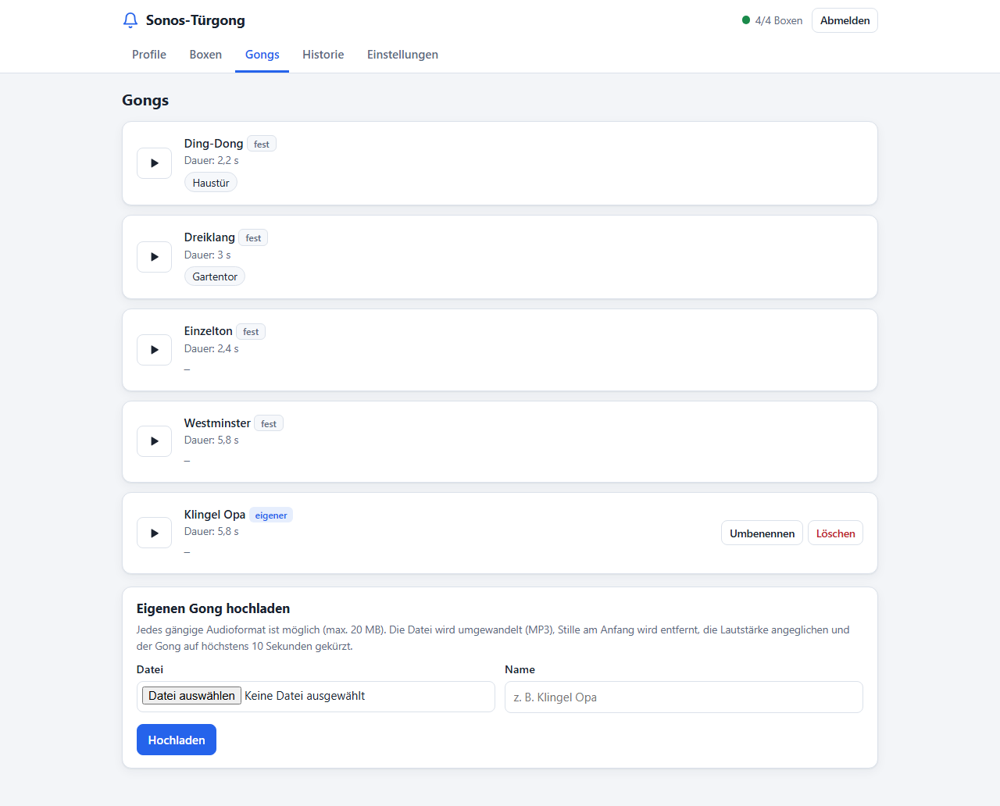
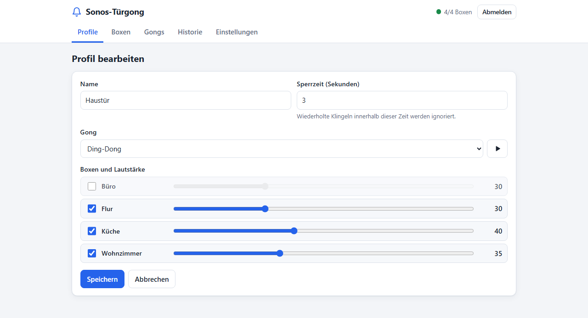
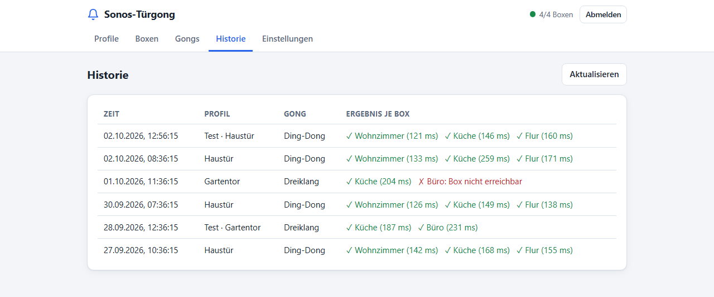
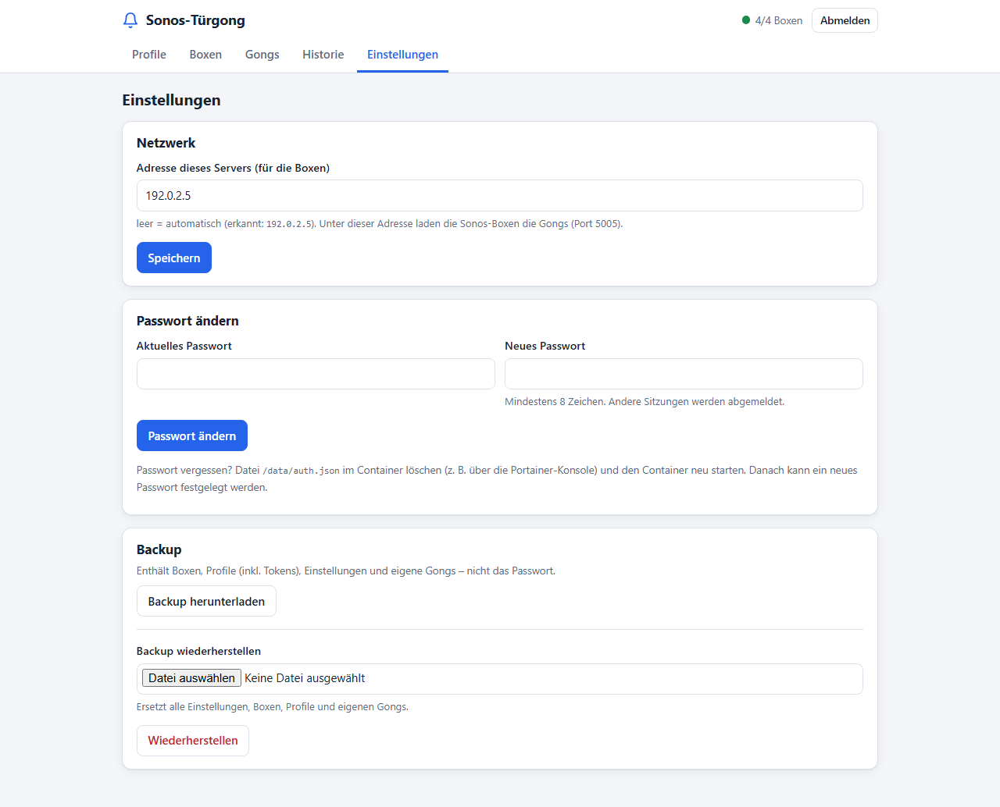

# Anleitung: Sonos-Türgong

Diese Anleitung führt Schritt für Schritt von der ersten Anmeldung bis zum
funktionierenden Türgong. Die Installation des Dienstes steht in der
[README](../README.md).

## Inhalt

1. [Erste Schritte](#erste-schritte)
2. [Boxen](#boxen)
3. [Gongs](#gongs)
4. [Profile](#profile)
5. [Loxone einrichten](#loxone-einrichten)
6. [Historie](#historie)
7. [Einstellungen](#einstellungen)
8. [Passwort vergessen](#passwort-vergessen)
9. [Fehlersuche](#fehlersuche)

## Erste Schritte

**Weboberfläche öffnen:** Im Browser `http://<adresse-des-docker-hosts>:5005`
aufrufen, zum Beispiel `http://192.0.2.5:5005`. Das geht auch vom Handy aus.

**Passwort festlegen:** Beim allerersten Aufruf erscheint die Einrichtung.
Ein Passwort mit mindestens 8 Zeichen zweimal eingeben und speichern. Danach
ist man angemeldet; die Sitzung bleibt 30 Tage gültig. Später fragt die
Oberfläche beim Aufruf nach dem Passwort. „Abmelden“ steht oben rechts.

Oben rechts zeigt ein Status, wie viele Boxen verbunden sind (z. B.
„4/4 Boxen“). Grün heißt: alle verbunden.

Die Reiter *Profile*, *Boxen*, *Gongs*, *Historie* und *Einstellungen* führen
durch die Bereiche. Empfohlene Reihenfolge: Boxen, Profil, Loxone.


## Boxen

Im Reiter *Boxen* stehen alle angelegten Sonos-Boxen mit Verbindungsstatus
(grüner Punkt = verbunden), IP-Adresse und den Profilen, die sie verwenden.



**Im Netzwerk suchen:** „Im Netzwerk suchen“ klicken und einige Sekunden
warten. Die gefundenen Boxen erscheinen mit Name, IP und Modell. Mit
„Hinzufügen“ übernehmen; bereits angelegte Boxen sind mit „bereits angelegt“
markiert.



**Manuell anlegen:** Findet die Suche nichts (z. B. wegen Docker Desktop oder
getrenntem VLAN), unten unter „Box manuell hinzufügen“ die IP-Adresse der Box
eintragen. Der Name ist optional; leer übernimmt die Oberfläche den Namen aus
Sonos.

**Testgong:** „Testgong“ bei einer Box spielt den Gong Ding-Dong mit mittlerer
Lautstärke nur auf dieser Box. Schlägt es fehl, erscheint eine Meldung mit der
Ursache.

**Bearbeiten und Löschen:** Name und IP lassen sich ändern. Beim Löschen
wird die Box auch aus allen Profilen entfernt.

**Status:** Der Dienst hält zu jeder Box dauerhaft eine Verbindung offen und
prüft sie regelmäßig. Ein roter Punkt („nicht verbunden“) heißt, dass die Box
gerade nicht erreichbar ist.

## Gongs

Der Reiter *Gongs* listet alle Töne. Mit dem Play-Knopf lässt sich jeder Gong
im Browser vorhören.



- **Mitgelieferte Gongs:** Ding-Dong, Dreiklang, Einzelton und Westminster
  (Kennzeichnung „fest“). Sie lassen sich nicht ändern oder löschen.
- **Eigenen Gong hochladen:** Datei auswählen (jedes gängige Audioformat, bis
  20 MB), einen Namen vergeben und „Hochladen“ klicken. Die Datei wird dabei
  automatisch bearbeitet: Umwandlung in MP3, Stille am Anfang wird entfernt,
  die Lautstärke wird angeglichen und der Gong nach 10 Sekunden mit
  Ausblenden beendet. Das kann einige Sekunden dauern.
- **Umbenennen und Löschen** gibt es nur für eigene Gongs. Ein Gong, der noch
  von einem Profil verwendet wird, lässt sich nicht löschen; die Profile
  stehen unter dem Gong.

## Profile

Ein Profil bestimmt, **welcher Gong auf welchen Boxen mit welcher Lautstärke**
läuft. Typisch ist ein Profil pro Klingel, z. B. „Haustür“ und „Gartentor“.

**Anlegen:** Im Reiter *Profile* „Neues Profil“ wählen. Zum Ändern bei einem
bestehenden Profil „Bearbeiten“ klicken.



1. **Name** eingeben.
2. **Sperrzeit** festlegen (Sekunden). Wird innerhalb dieser Zeit erneut
   geklingelt, wird der zweite Aufruf ignoriert. Das schützt vor
   Mehrfachauslösung. Standard sind 3 Sekunden.
3. **Gong** wählen; der Play-Knopf daneben spielt ihn zur Probe im Browser.
4. **Boxen und Lautstärke:** Box ankreuzen und mit dem Regler die Lautstärke
   (0 bis 100) einstellen. Jede Box hat ihre eigene Lautstärke.
5. **Speichern.**

**Testen:** „Testen“ in der Profilkarte spielt den Gong sofort auf allen Boxen
des Profils, unabhängig von der Sperrzeit. Der Test erscheint in der Historie.

**Token neu erzeugen:** Jedes Profil hat einen geheimen Token, der den Aufruf
aus Loxone absichert. „Token neu erzeugen“ ersetzt ihn; der alte Loxone-Befehl
funktioniert dann nicht mehr und muss in Loxone Config neu eingetragen werden.

**Löschen:** Danach funktionieren Loxone-Aufrufe mit diesem Profil nicht mehr.

## Loxone einrichten

Jede Profilkarte zeigt einen **Loxone-Block** mit „Adresse“ und „Befehl“ samt
Schaltfläche „Kopieren“. Beides wird in Loxone Config eingetragen.

1. In Loxone Config unter *Peripherie* einen **Virtuellen Ausgang** anlegen.
   - Bezeichnung: z. B. `Sonos-Türgong`
   - Adresse: die **Adresse** aus dem Profil kopieren, z. B.
     `http://192.0.2.5:5005`
2. Unter diesem Ausgang einen **Virtuellen Ausgang Befehl** anlegen.
   - Bezeichnung: z. B. `Haustür`
   - Befehl bei EIN: den **Befehl** aus dem Profil kopieren, z. B.
     `/ring?profile=haustuer&token=...`
   - HTTP-Methode: `GET`
   - Befehl bei AUS: leer lassen
   - „Als Digitalausgang verwenden“ aktivieren
3. Den Befehl mit dem Klingelsignal verbinden: mit dem Eingang des
   Klingeltasters oder dem Ausgang „Klingel“ des Intercom-Bausteins.
   Liefert die Quelle ein Dauersignal, einen **Monoflop** (kurzer Impuls)
   dazwischen setzen, damit nur einmal geklingelt wird.
4. Speichern, auf den Miniserver übertragen und klingeln. Der Aufruf erscheint
   in der Historie.

**Pro Profil ein eigener Ausgang-Befehl:** Für jede weitere Klingel oder
Tageszeit ein weiteres Profil anlegen und dessen Befehl als eigenen
*Virtuellen Ausgang Befehl* einrichten. Die Adresse bleibt gleich.

## Historie

Der Reiter *Historie* zeigt alle Klingelvorgänge der letzten 30 Tage, neueste
zuerst: Zeit, Profil („Test“ bei Tests aus der Oberfläche), Gong und das
Ergebnis je Box. Ein grünes Häkchen steht mit der Reaktionszeit in
Millisekunden, ein rotes Kreuz mit der Fehlermeldung. „Aktualisieren“ lädt
die Liste neu.



Aufrufe, die wegen der Sperrzeit ignoriert wurden, erscheinen hier nicht.

## Einstellungen



- **Adresse dieses Servers (für die Boxen):** Unter dieser Adresse laden die
  Sonos-Boxen den Gong ab; sie ist auch Teil der Loxone-Adresse. Leer
  bedeutet automatische Erkennung (die erkannte Adresse steht darunter). Bei
  Host-Networking passt das meist; läuft der Container anders, hier die
  LAN-IP des Docker-Hosts eintragen. Nach einer Änderung die Adresse in
  Loxone anpassen.
- **Passwort ändern:** Aktuelles und neues Passwort (mindestens 8 Zeichen)
  eingeben. Andere Sitzungen werden abgemeldet.
- **Backup herunterladen:** Eine ZIP-Datei mit Boxen, Profilen (inklusive
  Tokens), Einstellungen und eigenen Gongs, ohne Passwort. Die Datei sicher
  aufbewahren, denn sie enthält die Tokens.
- **Backup wiederherstellen:** ZIP-Datei auswählen und „Wiederherstellen“
  klicken. Das **ersetzt** alle Einstellungen, Boxen, Profile und eigenen
  Gongs. Das Passwort bleibt bestehen.

## Passwort vergessen

1. In Portainer: *Containers* → `sonos-doorbell` → *Console* → `/bin/sh` →
   *Connect*.
2. Ausführen:

   ```bash
   rm /data/auth.json
   ```

3. Den Container neu starten.
4. Die Weboberfläche öffnen und ein neues Passwort festlegen.

Boxen, Profile und Gongs bleiben erhalten.

## Fehlersuche

| Problem | Ursache und Lösung |
|---|---|
| Box hat keinen grünen Punkt | Box nicht erreichbar oder Port 1443 blockiert (Firewall, anderes VLAN). Die Box muss Sonos S2 nutzen. |
| Testgong ohne Fehlermeldung, aber kein Ton | Die Box kann die Gong-Datei nicht laden. „Adresse dieses Servers“ in den Einstellungen prüfen und Port 5005 in der Firewall des Hosts freigeben. |
| „Im Netzwerk suchen“ findet nichts | Multicast funktioniert nicht (z. B. Docker Desktop, VLAN). Box manuell per IP anlegen. |
| Loxone-Aufruf liefert `403` | Profil oder Token stimmen nicht, z. B. nach „Token neu erzeugen“. Befehl aus dem Profil neu kopieren. |
| Es klingelt nicht, die Historie bleibt leer | Der Aufruf kommt nicht an. Adresse und Port in Loxone prüfen; `http://<adresse>:5005/health` im Browser muss `ok` melden. |
| Loxone löst aus, aber es klingelt nicht | Möglicherweise läuft noch die Sperrzeit des Profils. |
| Upload schlägt fehl | Datei ist kein gültiges Audio, größer als 20 MB oder enthält nur Stille. |
